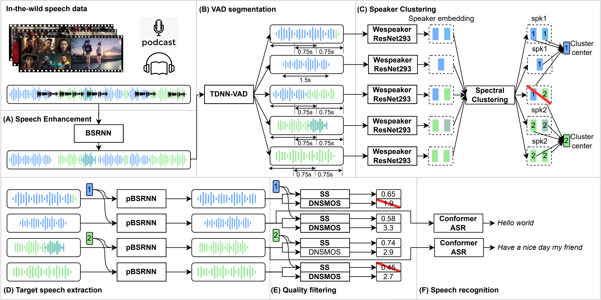

# 
 AutoPrep 

 Jianwei Yu1, Hangting Chen1, Yanyao Bian 1, Xiang Li1, Yi Luo1, Jinchuan Tian1, Mengyang Liu1, Jiayi Jiang1, Shuai Wang2
 
 

 1 Tencent AI Lab

 2 Shenzhen Research Institude of Big data 

## Abstract
Recently, the utilization of extensive open-sourced text data has significantly advanced the performance of text-based large language models (LLMs). 
However, the use of in-the-wild large-scale speech data in the speech technology community remains constrained. 
One reason for this limitation is that a considerable amount of the publicly available speech data is compromised by background noise, speech overlapping, lack of speech segmentation information, missing speaker labels, and incomplete transcriptions, which can largely hinder their usefulness. On the other hand, human annotation of speech data is both time-consuming and costly.
To address this issue, we introduce an automatic in-the-wild speech data preprocessing framework (AutoPrep) in this paper, which is designed to enhance speech quality, generate speaker labels, and produce transcriptions automatically.
The proposed AutoPrep framework comprises six components: speech enhancement, speech segmentation, speaker clustering, target speech extraction, quality filtering and automatic speech recognition.
Experiments conducted on the open-sourced WenetSpeech and our self-collected AutoPrepWild corpora demonstrate that the proposed AutoPrep framework can generate preprocessed data with similar DNSMOS and PDNSMOS scores compared to several open-sourced TTS datasets. 
The corresponding TTS system can achieve up to 0.68 in-domain speaker similarity.

    
     
    
 Fig.1: The diagram of the proposed full-band AutoPrep framework. 

## Dataset

- **AutoPrepWild**: The AutoPrepWild corpus is a collection of in-the-wild speech data that we gathered from publicly available podcasts, video recordings, and audiobooks, without segmentation, speaker labels, or text transcriptions. The original dataset consists of 680 unprocessed long audio recordings, with a total duration of approximately 498 hours. Unlike the WenetSpeech dataset, the sample rate of the AutoPrepWild corpus is either 24kHz or 44.1kHz.
- **WenetSpeech**: [WenetSpeech](https://github.com/wenet-e2e/WenetSpeech) is a widely used open-source ASR corpus, that comprises over 10,000 hours of Mandarin 16kHz speech data from diverse sources such as YouTube and Podcasts.Being derived from real-world data, WenetSpeech covers an extensive variety of acoustic conditions and includes a substantial number of speakers,  making it highly suitable for the application scenarios of AutoPrep.

## Processing results on AutoPrepWild

### Examples of processing results

#### Original long audio

[Source media Link](https://www.youtube.com/embed/_HJVhC80vIE?start=938)

#### Part of the speech segments and speaker labels

| Speaker ID (cluster) | Speech segment | Speech segment (enhanced) |
| :------------------: | :------------: | :-----------------------: |
| 1 | <audio src="static/samples/AutoPrepWild/process/seg_0_0.wav" controls preload></audio> | <audio src="static/samples/AutoPrepWild/process/seg_enhanced_0_0.wav" controls preload></audio> |
| 1 | <audio src="static/samples/AutoPrepWild/process/seg_0_1.wav" controls preload></audio> | <audio src="static/samples/AutoPrepWild/process/seg_enhanced_0_1.wav" controls preload></audio> |
| 1 | <audio src="static/samples/AutoPrepWild/process/seg_0_2.wav" controls preload></audio> | <audio src="static/samples/AutoPrepWild/process/seg_enhanced_0_2.wav" controls preload></audio> |
| 2 | <audio src="static/samples/AutoPrepWild/process/seg_1_0.wav" controls preload></audio> | <audio src="static/samples/AutoPrepWild/process/seg_enhanced_1_0.wav" controls preload></audio> |
| 2 | <audio src="static/samples/AutoPrepWild/process/seg_1_1.wav" controls preload></audio> | <audio src="static/samples/AutoPrepWild/process/seg_enhanced_1_1.wav" controls preload></audio> |
| 2 | <audio src="static/samples/AutoPrepWild/process/seg_1_2.wav" controls preload></audio> | <audio src="static/samples/AutoPrepWild/process/seg_enhanced_1_2.wav" controls preload></audio> |
| 3 | <audio src="static/samples/AutoPrepWild/process/seg_2_0.wav" controls preload></audio> | <audio src="static/samples/AutoPrepWild/process/seg_enhanced_2_0.wav" controls preload></audio> |
| 3 | <audio src="static/samples/AutoPrepWild/process/seg_2_1.wav" controls preload></audio> | <audio src="static/samples/AutoPrepWild/process/seg_enhanced_2_1.wav" controls preload></audio> |
| 3 | <audio src="static/samples/AutoPrepWild/process/seg_2_2.wav" controls preload></audio> | <audio src="static/samples/AutoPrepWild/process/seg_enhanced_2_2.wav" controls preload></audio> |
| 4 | <audio src="static/samples/AutoPrepWild/process/seg_3_0.wav" controls preload></audio> | <audio src="static/samples/AutoPrepWild/process/seg_enhanced_3_0.wav" controls preload></audio> |

## Processing results on WenetSpeech

#### Original long audio

[Source long audio ID `Y0000005116_CcX1LRPz1ZA`](https://github.com/wenet-e2e/WenetSpeech)

#### Part of the speech segments and speaker labels

| Speaker ID (cluster) | Speech segment | Speech segment (enhanced) |
| :------------------: | :------------: | :-----------------------: |
| 1 | <audio src="static/samples/WenetSpeech/process/seg_0_0.wav" controls preload></audio> | <audio src="static/samples/WenetSpeech/process/seg_enhanced_0_0.wav" controls preload></audio> |
| 1 | <audio src="static/samples/WenetSpeech/process/seg_0_1.wav" controls preload></audio> | <audio src="static/samples/WenetSpeech/process/seg_enhanced_0_1.wav" controls preload></audio> |
| 1 | <audio src="static/samples/WenetSpeech/process/seg_0_2.wav" controls preload></audio> | <audio src="static/samples/WenetSpeech/process/seg_enhanced_0_2.wav" controls preload></audio> |
| 2 | <audio src="static/samples/WenetSpeech/process/seg_1_0.wav" controls preload></audio> | <audio src="static/samples/WenetSpeech/process/seg_enhanced_1_0.wav" controls preload></audio> |
| 2 | <audio src="static/samples/WenetSpeech/process/seg_1_1.wav" controls preload></audio> | <audio src="static/samples/WenetSpeech/process/seg_enhanced_1_1.wav" controls preload></audio> |
| 2 | <audio src="static/samples/WenetSpeech/process/seg_1_2.wav" controls preload></audio> | <audio src="static/samples/WenetSpeech/process/seg_enhanced_1_2.wav" controls preload></audio> |
| 3 | <audio src="static/samples/WenetSpeech/process/seg_2_0.wav" controls preload></audio> | <audio src="static/samples/WenetSpeech/process/seg_enhanced_2_0.wav" controls preload></audio> |
| 3 | <audio src="static/samples/WenetSpeech/process/seg_2_1.wav" controls preload></audio> | <audio src="static/samples/WenetSpeech/process/seg_enhanced_2_1.wav" controls preload></audio> |
| 3 | <audio src="static/samples/WenetSpeech/process/seg_2_2.wav" controls preload></audio> | <audio src="static/samples/WenetSpeech/process/seg_enhanced_2_2.wav" controls preload></audio> |
| 4 | <audio src="static/samples/WenetSpeech/process/seg_3_0.wav" controls preload></audio> | <audio src="static/samples/WenetSpeech/process/seg_enhanced_3_0.wav" controls preload></audio> |
| 4 | <audio src="static/samples/WenetSpeech/process/seg_3_1.wav" controls preload></audio> | <audio src="static/samples/WenetSpeech/process/seg_enhanced_3_1.wav" controls preload></audio> |
| 4 | <audio src="static/samples/WenetSpeech/process/seg_3_2.wav" controls preload></audio> | <audio src="static/samples/WenetSpeech/process/seg_enhanced_3_2.wav" controls preload></audio> |

## Synthetic audios of WenetSpeech speakers

| Speaker prompt (GT) | Synthetic speech (Trained on data without enhancement) | Synthetic speech (Trained on data with enhancement) | Content of the synthetic Speech |
| :------------------: | :------------: | :------------: | :-----------------------: |
|  <audio src="static/samples/WenetSpeech/synthetic/prompt_0_0.wav" controls preload></audio> | <audio src="static/samples/WenetSpeech/synthetic/synthetic_noisy_0_0.wav" controls preload></audio> | <audio src="static/samples/WenetSpeech/synthetic/synthetic_0_0.wav" controls preload></audio> | 九月的这个刺客，团战基本上能盯着你的后排切，他在队伍里也是总击杀最多的人 |
|  <audio src="static/samples/WenetSpeech/synthetic/prompt_0_1.wav" controls preload></audio> | <audio src="static/samples/WenetSpeech/synthetic/synthetic_noisy_0_1.wav" controls preload></audio> | <audio src="static/samples/WenetSpeech/synthetic/synthetic_0_1.wav" controls preload></audio> | 红方这只队伍的关键点在打野身上，给他拿到一手镜也能更好的带动队伍节奏 |
|  <audio src="static/samples/WenetSpeech/synthetic/prompt_1_0.wav" controls preload></audio> | <audio src="static/samples/WenetSpeech/synthetic/synthetic_noisy_1_0.wav" controls preload></audio> | <audio src="static/samples/WenetSpeech/synthetic/synthetic_1_0.wav" controls preload></audio> | 九月的这个刺客，团战基本上能盯着你的后排切，他在队伍里也是总击杀最多的人 |
|  <audio src="static/samples/WenetSpeech/synthetic/prompt_1_1.wav" controls preload></audio> | <audio src="static/samples/WenetSpeech/synthetic/synthetic_noisy_1_1.wav" controls preload></audio> | <audio src="static/samples/WenetSpeech/synthetic/synthetic_1_1.wav" controls preload></audio> | 这力量在随后几年多次保护她，但也引来了觊觎之人。 |
|  <audio src="static/samples/WenetSpeech/synthetic/prompt_2_0.wav" controls preload></audio> | <audio src="static/samples/WenetSpeech/synthetic/synthetic_noisy_2_0.wav" controls preload></audio> | <audio src="static/samples/WenetSpeech/synthetic/synthetic_2_0.wav" controls preload></audio> | 这个镜还是怕对方九月选手拿到的，东方镜胜率有67%，确实不能放 |
|  <audio src="static/samples/WenetSpeech/synthetic/prompt_2_1.wav" controls preload></audio> | <audio src="static/samples/WenetSpeech/synthetic/synthetic_noisy_2_1.wav" controls preload></audio> | <audio src="static/samples/WenetSpeech/synthetic/synthetic_2_1.wav" controls preload></audio> | 九月拿到了自己的常用英雄，身为队伍的核心，相信镜也将会成为场上的焦点 |
|  <audio src="static/samples/WenetSpeech/synthetic/prompt_3_0.wav" controls preload></audio> | <audio src="static/samples/WenetSpeech/synthetic/synthetic_noisy_3_0.wav" controls preload></audio> | <audio src="static/samples/WenetSpeech/synthetic/synthetic_3_0.wav" controls preload></audio> | 西施的童年并非无忧无虑，自小便学会了各种谋生的小把戏。 |
|  <audio src="static/samples/WenetSpeech/synthetic/prompt_3_1.wav" controls preload></audio> | <audio src="static/samples/WenetSpeech/synthetic/synthetic_noisy_3_1.wav" controls preload></audio> | <audio src="static/samples/WenetSpeech/synthetic/synthetic_3_1.wav" controls preload></audio> | 一边学习魔道课程，一边参与各种大奖赛事， |
|  <audio src="static/samples/WenetSpeech/synthetic/prompt_4_0.wav" controls preload></audio> | <audio src="static/samples/WenetSpeech/synthetic/synthetic_noisy_4_0.wav" controls preload></audio> | <audio src="static/samples/WenetSpeech/synthetic/synthetic_4_0.wav" controls preload></audio> | 九月的这个刺客，团战基本上能盯着你的后排切，他在队伍里也是总击杀最多的人 |
|  <audio src="static/samples/WenetSpeech/synthetic/prompt_4_1.wav" controls preload></audio> | <audio src="static/samples/WenetSpeech/synthetic/synthetic_noisy_4_1.wav" controls preload></audio> | <audio src="static/samples/WenetSpeech/synthetic/synthetic_4_1.wav" controls preload></audio> | 西施的童年并非无忧无虑，自小便学会了各种谋生的小把戏。 |
|  <audio src="static/samples/WenetSpeech/synthetic/prompt_5_0.wav" controls preload></audio> | <audio src="static/samples/WenetSpeech/synthetic/synthetic_noisy_5_0.wav" controls preload></audio> | <audio src="static/samples/WenetSpeech/synthetic/synthetic_5_0.wav" controls preload></audio> | 不明真相的西施被庄周所救，隐姓埋名来到稷下。 |
|  <audio src="static/samples/WenetSpeech/synthetic/prompt_5_1.wav" controls preload></audio> | <audio src="static/samples/WenetSpeech/synthetic/synthetic_noisy_5_1.wav" controls preload></audio> | <audio src="static/samples/WenetSpeech/synthetic/synthetic_5_1.wav" controls preload></audio> | 九月拿到了自己的常用英雄，身为队伍的核心，相信镜也将会成为场上的焦点 |
|  <audio src="static/samples/WenetSpeech/synthetic/prompt_6_0.wav" controls preload></audio> | <audio src="static/samples/WenetSpeech/synthetic/synthetic_noisy_6_0.wav" controls preload></audio> | <audio src="static/samples/WenetSpeech/synthetic/synthetic_6_0.wav" controls preload></audio> | 这个镜还是怕对方九月选手拿到的，东方镜胜率有67%，确实不能放 |
|  <audio src="static/samples/WenetSpeech/synthetic/prompt_6_1.wav" controls preload></audio> | <audio src="static/samples/WenetSpeech/synthetic/synthetic_noisy_6_1.wav" controls preload></audio> | <audio src="static/samples/WenetSpeech/synthetic/synthetic_6_1.wav" controls preload></audio> | 不明真相的西施被庄周所救，隐姓埋名来到稷下。 |

## Synthetic audios of AutoPrepWild speakers

| Speaker | Synthetic speech | Content of the synthetic Speech |
| :-----: | :------------: | :-----------------------: |
| 1 | <audio src="static/samples/AutoPrepWild/synthetic/synthetic_2_0.wav" controls preload></audio> | 财联社9月22日电，洲际油气触及跌停，新潮能源、海默科技、蓝焰控股、石化油服、潜能恒信等跌幅居前。 |
| 1 | <audio src="static/samples/AutoPrepWild/synthetic/synthetic_2_1.wav" controls preload></audio> | 我是波克机器人，作为一名男议员，小心翼翼的政治家，害怕变革，倾向于选择保守的策略，共有3种情绪，>包括高兴，兴奋和不耐烦。 |
| 2 | <audio src="static/samples/AutoPrepWild/synthetic/synthetic_0_0.wav" controls preload></audio> | 我是谢顶男议员，尸位素餐的中年高位者，贵族出身，惯性嘲讽年轻人。 |
| 2 | <audio src="static/samples/AutoPrepWild/synthetic/synthetic_0_1.wav" controls preload></audio> | 纱的力量来自遥远神秘的南洲，和她的家族息息相关。 |